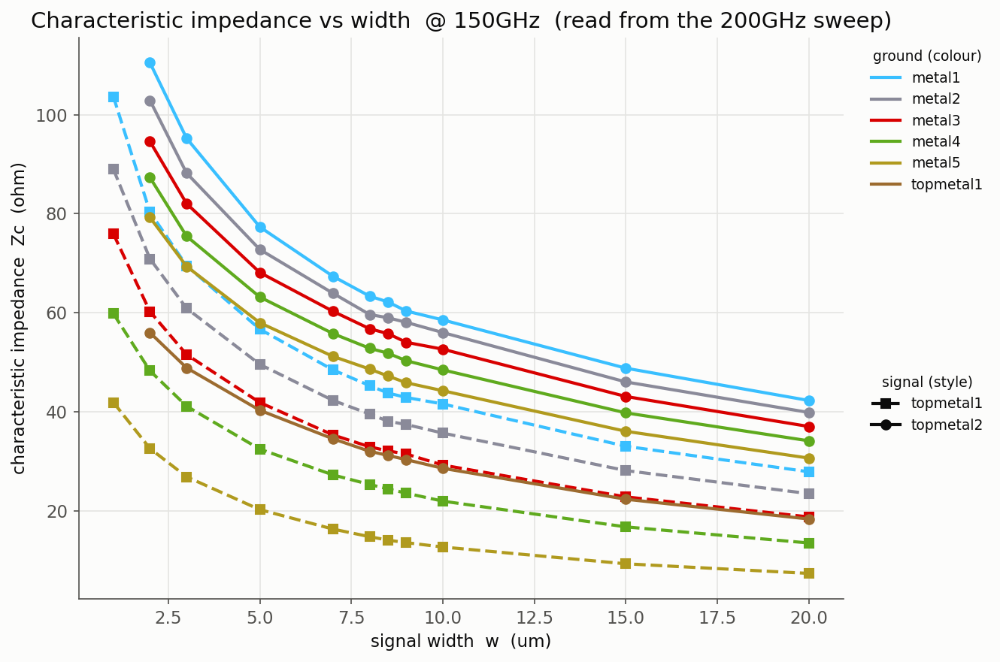
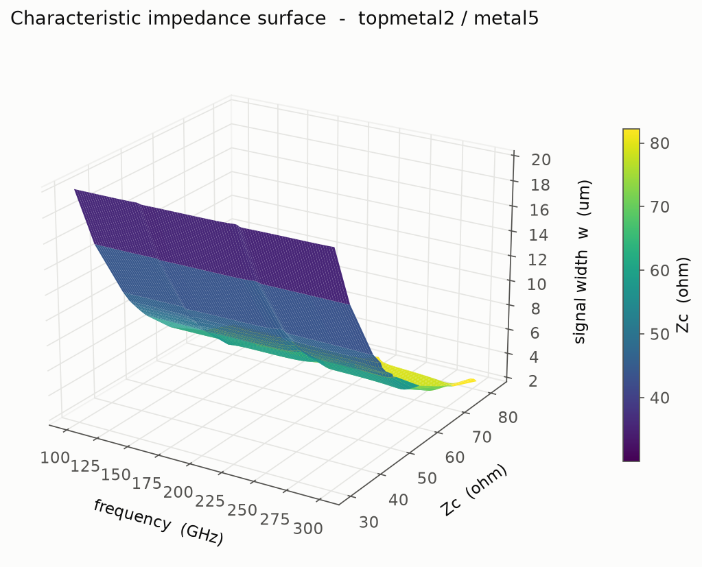
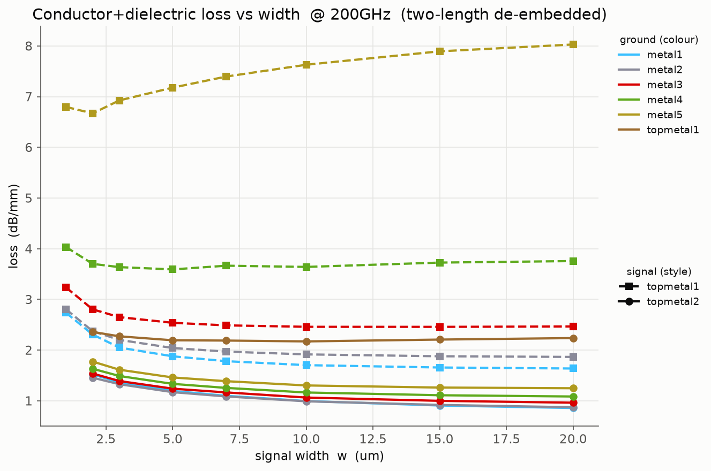
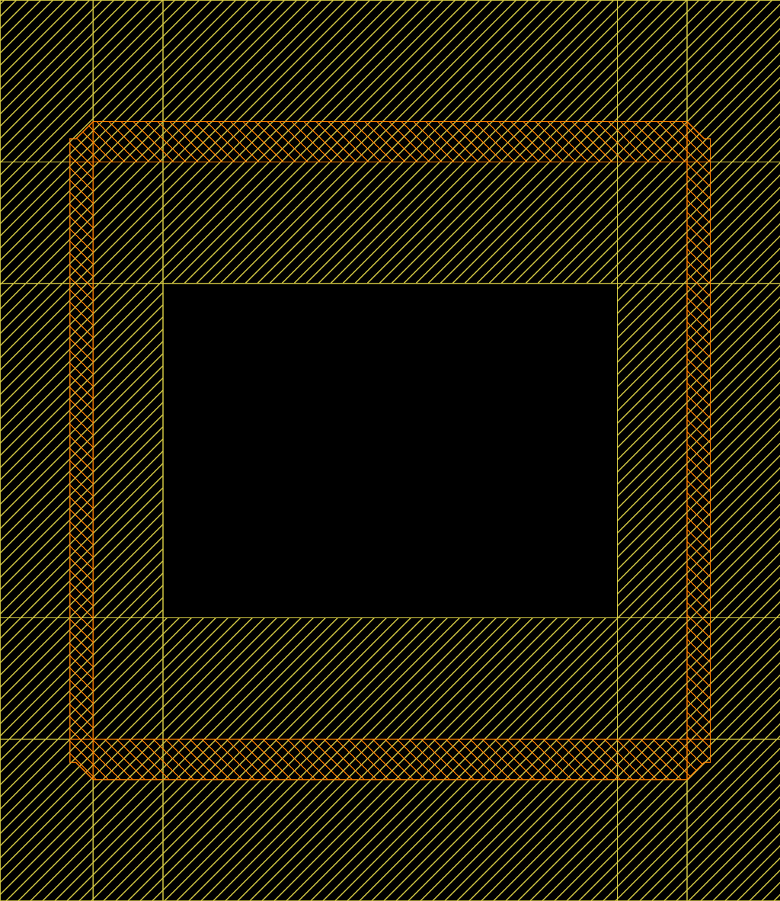
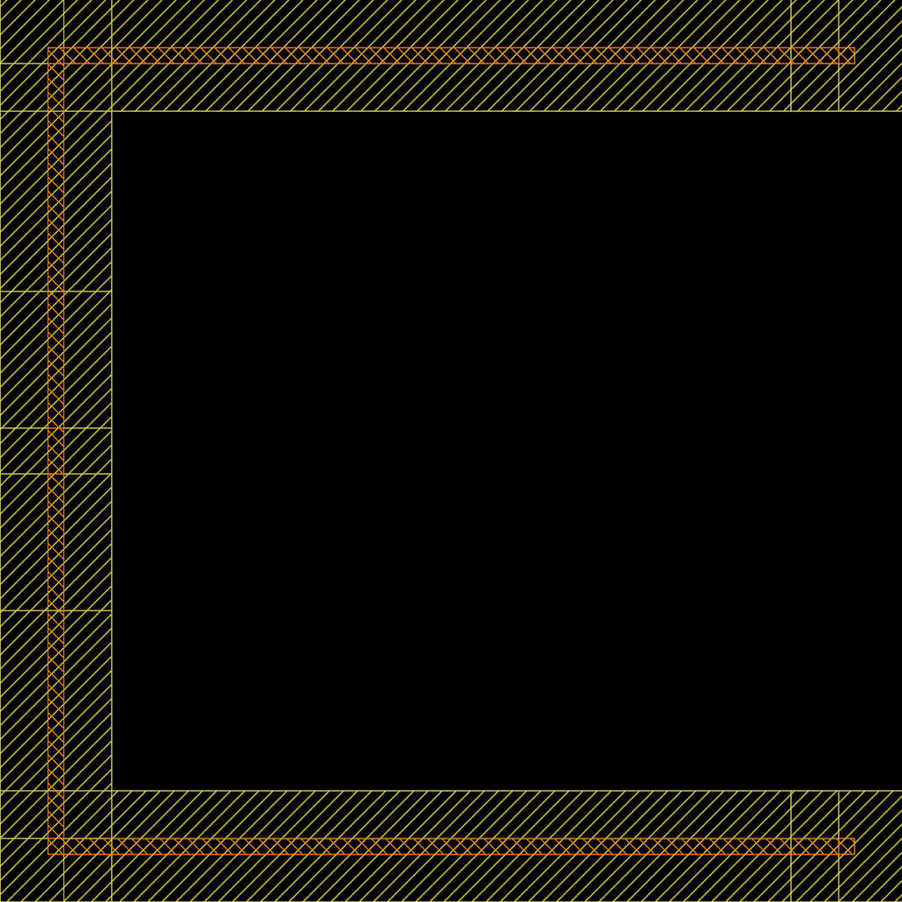
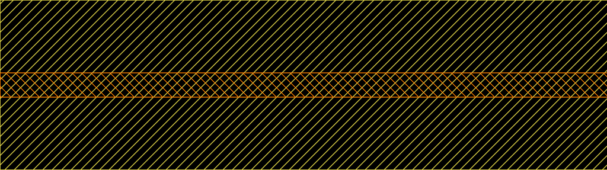

# RF structure evaluation (IHP SG13G2)

EM characterization of passive RF structures in the IHP SG13G2 open PDK, using
[gdsfactory]/[IHP PDK] for layout, [Palace] for the FEM field solve, and
[scikit-rf] for S-parameter post-processing.

The whole flow is driven by the [`Makefile`](Makefile) — run `make help` for the
target list.

```
generate  ->  sim  ->  plot
 (Python)     (Palace)  (Python)
```

1. **generate** — build GDS layouts of test structures into `gds/<sweep>/`
2. **sim** — mesh each GDS and run Palace, then convert the raw solver output to
   Touchstone (`.sNp`) with `combine_snp.py`
3. **plot** — extract the figures of merit from the `.sNp` files into `images/`

---

## Quick start

Do one sweep end to end (the z0 sweep is the cheapest — a single frequency point per line):

```bash
make generate-tline-z0
make sim-tline-z0        # runs Palace on every generated GDS (slow)
make plot-tline-z0       # writes images/tline_z0_<freq>GHz.png + .csv
```

The same three-step pattern works for every sweep (`-tline-loss`, `-blc`, …).

> **Cost warning.** Each `sim-*` target launches one Palace run per GDS file. The
> full tline sweeps are hundreds–thousands of runs (hours of compute). Generate and
> simulate one sweep at a time; don't run `make all` unattended.

---

## The sweeps

| Sweep | Structure | What it measures | Ports | Frequency |
|-------|-----------|------------------|-------|-----------|
| `tline-z0` | straight line, width swept | characteristic impedance `Zc(w)` | 2 | single point |
| `tline-loss` | straight line, two lengths per point | loss per mm `α(w, f)` | 2 | full band |
| `tline-sparams` | fixed-50 Ω line, length swept | raw S-parameters (verification) | 2 | full band |
| `blc` | branch-line coupler, one per design freq | coupling / isolation / phase balance | 4 | full band |
| `wpd` | Wilkinson power divider (U-shape), one per design freq | split / match / phase balance | 3 | full band |

All sweeps are restricted to **RF-viable metal stacks** — signal on `TopMetal1` or
`TopMetal2` (the thick, low-resistance top metals), any lower metal as ground
(`RF_METAL_STACKS` in [`tline_common.py`](tline_common.py)). The thin `Metal1`–`Metal5`
layers are logic/routing layers and aren't sensible RF signal lines, so they're
excluded. Sweep parameters (widths, lengths, frequencies) live at the top of each
`generate_*.py` and are the intended place to edit.

---

## Results

Figures below are the PNGs written into `images/` by `make plot`. They point at the
files by path, so re-running a `plot-*` target that overwrites the same filename
refreshes the image here automatically (commit the new PNG). If you change which
frequencies or stacks are swept the filenames change, so the embeds below have to be
updated by hand to match — some may show as broken until the corresponding sim + plot
has been run.

### Transmission lines

Characteristic impedance vs signal width, faceted by ground layer (`plot-tline-z0`):

<p align="center">
  
</p>

Impedance dispersion as a 3D surface `Zc(freq, width)` for one stack — TopMetal2 over
Metal5 (`plot-tline-z0-3d`):

<p align="center">
  
</p>

Loss per mm vs width, two-length de-embedded (`plot-tline-loss`):

<p align="center">
  
</p>

### Layout previews

Quick KLayout renders of the generated GDS, produced by `make img-blc`, `make img-wpd`
and `make img-tline` — signal `TopMetal2` (orange) over the `Metal5` ground plane
(yellow):

Branch-line coupler — a 90° hybrid: a square ring of four quarter-wave branches with
a port at each corner (`blc_200GHz`):

<p align="center">
  
</p>

Wilkinson power divider (U-shape) — one input splitting into two quarter-wave arms
(`wpd_200GHz`):

<p align="center">
  
</p>

Transmission line — a straight signal line over ground, the building block of the
z0/loss sweeps (here 20 µm wide, 500 µm long):

<p align="center">
  
</p>

---

## How the extraction works

The Palace ports are **lumped ports referenced to 50 Ω**, so the solver returns
S-parameters normalized to 50 Ω, not to the line's own impedance. The post-processing
corrects for that:

- **`Zc(w)` — single-line extraction** (Eul-Schiek / Bianco). A uniform, symmetric,
  reciprocal 2-port has a closed-form solution for `Zc` and `γ` from its 50 Ω
  S-parameters, so a single line is enough. Correct even though the lines are not 50 Ω
  (which is the whole point of the width sweep).

- **`α(w,f)` — two-length de-embedding.** Two lines of identical width/stack/frequency
  but different length (`length1`, `length2`) are simulated with the *same* port
  launch. Eigenvalues of `T2·T1⁻¹` (the ratio of the two ABCD matrices) equal
  `e^(±γ·ΔL)` regardless of what the port launch does, so port/launch effects cancel
  **exactly** — no assumed port model. Only the real part (loss) is used; the phase
  wraps over `ΔL` and isn't recovered here.

- **BLC — data-driven port roles.** Input is assumed to be port 1. Rather than
  hard-coding which port is through/coupled/isolated, the two ports with the largest
  `|Sx1|` at the design frequency are taken as the outputs and the weakest as the
  isolated port. The design frequency is read from the *directory* name
  (`blc_<N>GHz/…`), not the leaf filename (Palace names every run's output file the
  same, so leaf names would collide).

- **WPD — fixed port roles.** Unlike the BLC there is nothing to classify: port 1 is
  the input, ports 2/3 the outputs (as tagged in `generate_wpd.py`), and the outputs
  of a Wilkinson are ideally *in phase* (0°, not 90°). Note the PDK cell does **not**
  place the isolation resistor (its placement is commented out upstream), so the
  simulated structure is the resistor-less divider: |S32| and the output match will
  look poor — that is physical, not a sim error. Split, input match and output
  balance are the meaningful metrics.

See the module docstrings in [`plot_tline.py`](plot_tline.py),
[`plot_blc.py`](plot_blc.py) and [`plot_wpd.py`](plot_wpd.py) for the equations.

---

## Makefile targets

Run `make help` for the live list. Grouped:

| Group | Targets |
|-------|---------|
| generate | `generate-blc`, `generate-wpd`, `generate-tline-{sparams,z0,loss}`, `generate-tline`, `generate` |
| sim | `sim-blc`, `sim-wpd`, `sim-tline-{sparams,z0,loss}`, `sim-tline`, `sim` |
| plot | `plot-tline-{z0,z0-freq,z0-3d,loss,design}`, `plot-tline-sparams`, `plot-tline`, `plot-blc`, `plot-wpd`, `plot` |
| all-in-one | `all` (generate + sim + plot) |
| cleanup (keeps `.sNp`) | `clean-sim-raw` (meshes + raw Palace output + JSON configs), `clean-layouts` (`.gds` files), `clean-intermediates` (both) |
| cleanup (destructive) | `clean` (all of gds/, **incl. `.sNp`**), `clean-images` (images/), `clean-all` (both) |

The aggregate `sim` target runs `clean-intermediates` when all sweeps are done, so a
full simulation run leaves only the `.sNp` results on disk — meshes, raw Palace
output, JSON configs and the `.gds` layouts are all dropped (layouts are regenerated
by `make generate`; the plot targets read the design frequencies from the model
directory names, so they don't need the `.gds` files). The per-sweep `sim-*` targets
don't clean, so partial reruns keep their raw data — run `make clean-intermediates`
manually when you're done. Note that re-running `combine_snp.py` needs the raw CSVs
and `port_information.json`, so only clean once the `.sNp` files exist.

The three z0 plot targets are different views of the same `tline-z0` sim data:
`plot-tline-z0` is `Zc(w)` at one frequency, `plot-tline-z0-freq` shows the dispersion
`Zc(f)` per stack (curve per width), and `plot-tline-z0-3d` renders a 3D surface of
`Zc` over (frequency, width) for a single stack — TopMetal2/Metal5 by default,
`make plot-tline-z0-3d SIGNAL=topmetal1 GROUND=metal3` for another.

Each sim spans 0.5–1.5× its design frequency, so `plot-tline-z0` can also read `Zc`
anywhere in that band, not just at the design tag:

```bash
make plot-tline-z0 EVAL_FREQ=150      # Zc(w) @ 150 GHz, read from the 200 GHz sweep
make plot-tline-z0 FREQ=200           # restrict to one design tag (if several exist)
```

`plot-tline-design` is the synthesis view: a **Zc-vs-loss scatter** with one point per
(stack, width), joining the z0 sweep (Zc) with the loss sweep (two-length de-embedded
loss), so it needs sim results from both. "I need 70 Ω — what's the cheapest way to
get it?" is a vertical slice: find 70 Ω on the x-axis, take the lowest point. A dotted
envelope marks the lowest loss achievable per impedance bin.

`plot-tline-sparams` overlays raw S21/S11 for a **hand-picked** set of files (it gets
unreadable past ~8), so pass them explicitly:

```bash
make plot-tline-sparams FILES="gds/tline_sparams/lineA gds/tline_sparams/lineB"
```

> `make clean` deletes `gds/` **including all Palace meshes and `.sNp` results** (they
> live under `gds/<sweep>/<model>/`), which are expensive to regenerate. Use
> `clean-intermediates` to reclaim disk while keeping the `.sNp` results, or
> `clean-images` if you only want to redo the plots.

---

## File reference

| File | Role |
|------|------|
| [`Makefile`](Makefile) | orchestrates the whole pipeline |
| [`tline_common.py`](tline_common.py) | shared: metal stack list, `RF_METAL_STACKS`, GDS-writing helper |
| [`generate_blc.py`](generate_blc.py) | build the branch-line-coupler sweep |
| [`generate_wpd.py`](generate_wpd.py) | build the Wilkinson-power-divider sweep |
| [`generate_tline_z0.py`](generate_tline_z0.py) | build the `Zc(w)` line sweep |
| [`generate_tline_loss.py`](generate_tline_loss.py) | build the two-length loss sweep |
| [`generate_tline_sparams.py`](generate_tline_sparams.py) | build the fixed-50 Ω verification sweep |
| [`run_sim.sh`](run_sim.sh) | one GDS → mesh + config + one Palace run |
| [`run_more_sims.sh`](run_more_sims.sh) | loop `run_sim.sh` over a folder, then `combine_snp.py` |
| [`palace_auto_sim.py`](palace_auto_sim.py) | GDS + stackup → Gmsh mesh + Palace `config.json` (via `gds2palace`) |
| [`combine_snp.py`](combine_snp.py) | Palace/Elmer raw output → Touchstone `.sNp` (+ DC extrap, port de-embed) |
| [`plot_tline.py`](plot_tline.py) | `z0` / `z0-freq` / `z0-3d` / `loss` / `design` / `sparams` plotting + extraction |
| [`plot_blc.py`](plot_blc.py) | coupler S-params, imbalance, phase, and cross-design summary |
| [`plot_wpd.py`](plot_wpd.py) | divider S-params, imbalance, phase, and cross-design summary |
| `SG13G2_200um.xml` | **active** stackup (200 µm conductive substrate) used by `palace_auto_sim.py` |
| `SG13G2_nosub.xml` | alternative stackup without the substrate (faster, no substrate loss) |

`combine_snp.py` and `palace_auto_sim.py` are adapted from the upstream `gds2palace`
project — re-syncing them from upstream will overwrite local edits/comments.

---

## Configuration notes

- **Stackup**: set by `XML_filename` in [`palace_auto_sim.py`](palace_auto_sim.py)
  (currently `SG13G2_200um.xml`, which includes the conductive silicon substrate).
  Switch to `SG13G2_nosub.xml` to drop the substrate (faster, no substrate loss).
- **Port markers**: the generators tag port locations on GDS layers 201–204;
  `palace_auto_sim.py` turns layer `200+n` into lumped port `n` (50 Ω reference).
- **Palace parallelism**: `run_sim.sh` runs Palace on all machine cores minus 12
  (kept free for other users), with a floor of 1 — see the `-np` line to adjust.
  It also passes `--allow-run-as-root` (needed in the container).
- **Simulation band**: each Palace run sweeps `0.5×–1.5×` its center frequency; the
  center comes from the `_<N>GHz` tag in the GDS filename.

## Output layout

```
gds/<sweep>/*.gds                              # layouts (dropped by clean-intermediates)
gds/<sweep>/<model>/palace_auto_sim_data/      # mesh, config.json, Palace output, .sNp
images/*.png, *.csv                             # extracted results
```

## Data

The whole `gds/` tree (layouts + Palace meshes/output + `.sNp` results) is tracked
in git along with the code, so simulation results sync between machines through the
normal git flow. It is bulky — a full sweep is thousands of files — so expect large
commits/pushes after big simulation runs. `make clean` *deletes* `gds/` from disk
(destructive, local); use `clean-intermediates` to keep the `.sNp` results, or
`clean-images` if you only want to redo plots.

## Requirements

- Python: `gdsfactory`, the IHP PDK (`ihp`), `scikit-rf`, `numpy`, `matplotlib`, `gds2palace`, `gdspy`
  - the **local** `ihp` checkout is required: its `tline()` was patched to *warn*
    instead of raise when the closed-form Z0 approximation goes negative for wide
    lines on thin dielectrics (`ihp/cells/waveguides.py`); the stock package would
    abort the wide-width part of the z0/loss sweeps
- [Palace] on `PATH` (with an MPI launcher)
- Gmsh (pulled in by `gds2palace`)

[gdsfactory]: https://gdsfactory.github.io/gdsfactory/
[IHP PDK]: https://github.com/IHP-GmbH/IHP-Open-PDK
[Palace]: https://awslabs.github.io/palace/
[scikit-rf]: https://scikit-rf.readthedocs.io/
